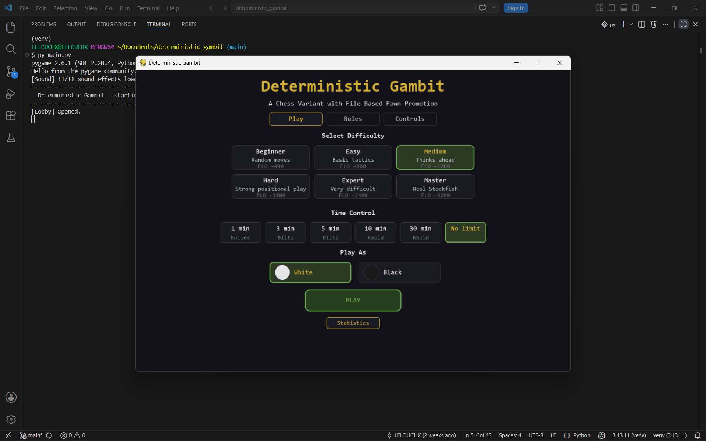
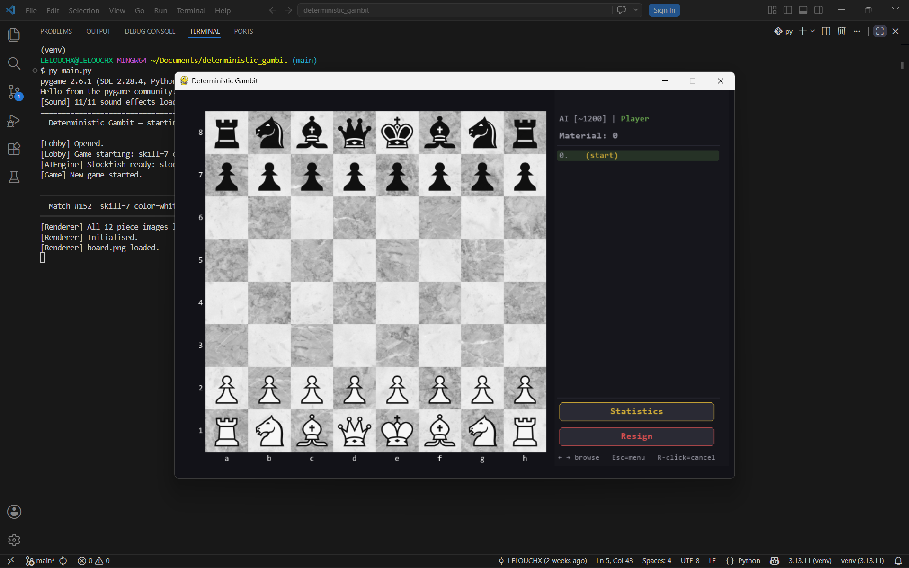
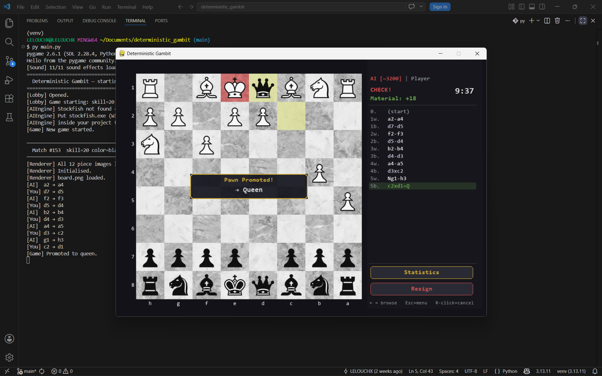

# Project Description

## 1. Project Overview

- **Project Name:** Deterministic Gambit

- **Brief Description:**
  Deterministic Gambit is a single-player chess variant built with Python and Pygame. The game introduces a rule modification where pawn promotion is determined by the pawn's starting file (column) rather than the player's choice — files a/h promote to Rook, b/g to Knight, c/f to Bishop, and d/e to Queen. Players compete against a Stockfish-powered AI opponent across six difficulty levels. The application includes a full move history browser with animation, a pre-move system, time controls, game saving and loading, and a statistics dashboard with five interactive charts built with Matplotlib.

  The statistical component records every move made across all sessions into CSV files, tracking evaluation scores, move durations, promotion events, and game outcomes. A separate statistics window visualises this data, allowing players to review their performance trends over time.

- **Problem Statement:**
  Standard chess has been solved extensively at the AI level, leaving human players with little room for novel strategic discovery in the opening and midgame. Deterministic Gambit solves this by changing a single deterministic rule (promotion outcome) in a way that gives every pawn a fixed long-term value based on its origin — making pawn structure and file control significantly more strategically meaningful than in standard chess.

- **Target Users:**
  Chess players who want a fresh strategic challenge on top of standard chess rules, students learning software design through a complete game project, and anyone interested in how a single rule change can fundamentally shift game strategy.

- **Key Features:**
  - File-based deterministic pawn promotion (the core variant rule)
  - Stockfish AI with six calibrated difficulty levels (ELO ~400 to ~3200)
  - Full standard chess rules (castling, en passant, 50-move draw, stalemate, checkmate)
  - Time controls: Bullet, Blitz, Rapid, or unlimited
  - Pre-move system — queue one move while the AI is thinking
  - Move history browser with forward/backward animation and sound mixing
  - Game save and load across sessions with clock state preserved
  - Statistics dashboard: game length distribution, moves vs duration, results pie chart, promotion frequency, evaluation score graph
  - Per-move data recording to CSV (eval score, duration, promotion, piece type)

- **Screenshots:**
  
  
  
  

- **Proposal:** [Project Proposal (PDF)](proposal.pdf)

- **YouTube Presentation:** [Watch on YouTube](https://www.youtube.com/watch?v=rDJd8iehzl4)
  - (1) Introduction and full demonstration of gameplay and statistics dashboard
  - (2) Explanation of class design and object-oriented structure
  - (3) Explanation of statistical data collection and visualisation

---

## 2. Concept

### 2.1 Background

- **Why this project exists:** Chess is a deeply studied game where opening theory is well established. A single deterministic rule change — fixing promotion outcomes by file — creates an entirely new strategic layer without changing any other rule, making the game familiar yet genuinely novel.

- **What inspired it:** The idea comes from the concept of "variant chess" used in competitive puzzle design, where minimal rule changes produce maximum strategic depth. Deterministic promotion forces players to value pawns differently from the start, because a passed a-file pawn and a passed d-file pawn now have completely different endgame potential.

- **Importance of solving this problem:** The game demonstrates that meaningful strategic innovation does not require rebuilding a game from scratch. It also serves as a complete software engineering exercise: combining game logic, AI integration, real-time rendering, data persistence, and data visualisation in one cohesive Python application.

### 2.2 Objectives

- Implement a fully playable chess variant with the deterministic promotion rule enforced correctly for both the player and the AI
- Integrate Stockfish via UCI protocol so the AI plays the variant legally (since promotion is handled by the game layer, not the engine)
- Record per-move gameplay data automatically and present it in a readable statistics dashboard
- Provide a polished user experience including sound feedback, move animation, pre-move queuing, history browsing, and game saving
- Demonstrate object-oriented design through clearly separated classes for board state, piece logic, AI communication, rendering, sound, and statistics

---

## 3. UML Class Diagram

The class diagram covers all major classes, their attributes, methods, and relationships.

**Submission:** [UML Class Diagram (PDF)](uml_diagram.pdf)

Key relationships shown in the diagram:
- `Game` aggregates `Board`, `AIEngine`, and `StatisticsManager`
- `Board` contains a grid of `Piece` subclasses (`Pawn`, `Rook`, `Knight`, `Bishop`, `Queen`, `King`)
- `Piece` is the base class; all piece types inherit from it
- `Renderer` depends on `Game` and `Board` for display data
- `Lobby` and `StatsWindow` are independent UI components launched from `main`

---

## 4. Object-Oriented Programming Implementation

- **`Piece` (base class):** Stores colour, position, and movement state. Defines the interface `get_valid_moves()` overridden by all subclasses. Contains the static `FILE_PROMOTION_MAP` that implements the deterministic promotion rule.

- **`Pawn`, `Rook`, `Knight`, `Bishop`, `Queen`, `King`:** Each inherits from `Piece` and implements `get_valid_moves()` with its own movement rules. `Pawn` additionally handles en passant detection and calls `promotion_piece()` to look up its fixed promotion type from `FILE_PROMOTION_MAP`.

- **`Board`:** Manages the 8×8 grid and the piece list. Implements `move_piece()` (handling castling, en passant capture, and promotion), `get_legal_moves()` (filters pseudo-legal moves by simulating each move and checking for self-check), `is_in_check()`, `has_any_legal_moves()`, and `to_fen()` for Stockfish communication.

- **`Game`:** Central game logic controller. Manages turn switching, clock state, move history, pre-move storage, save/restore serialisation, and result detection. Owns instances of `Board`, `AIEngine`, and `StatisticsManager`.

- **`AIEngine`:** Wraps the Stockfish process via UCI protocol using `subprocess`. Handles engine discovery, startup, move requests (`get_best_move()`), evaluation queries (`get_evaluation()`), and graceful shutdown.

- **`StatisticsManager`:** Records per-move data (player, piece, squares, duration, eval score, promotion) and per-game summaries to CSV files. Provides static methods for loading and summarising data for the dashboard.

- **`Renderer`:** All Pygame drawing logic. Draws the board, pieces, legal move dots, pre-move highlights, last-move highlights, check overlays, move animations (`Animation` class), the move log panel, clocks, and panel buttons. Stateless with respect to game logic — reads from `Game` and `Board` each frame.

- **`Animation`:** Lightweight data class holding a sliding piece animation (start pixel, end pixel, image, timing). Supports a `hide_pos` for reverse animations so the static piece is suppressed during playback.

- **`TurnIndicator`:** Smooth colour-interpolating indicator in the panel showing whose turn it is.

- **`SoundManager`:** Loads `.ogg` sound files at startup and exposes a simple `play(event)` interface. Sounds can be played simultaneously for combined events (e.g. capture + check).

- **`Lobby`:** Pygame-based main menu. Handles difficulty selection, time control, colour choice, saved game detection, and navigation to the statistics window.

- **`StatsWindow`:** Tkinter + Matplotlib statistics dashboard. Builds five charts lazily (on first tab visit) to keep the window fast to open. Implements `_on_close()` for safe canvas cleanup to prevent threading errors.

---

## 5. Statistical Data

### 5.1 Data Recording Method

Data is recorded automatically during gameplay with no player input required. Two CSV files are maintained in the `data/` directory:

- **`move_data.csv`** — one row per half-move (ply), written by `StatisticsManager.record_move()` immediately after each move executes. Columns: `game_id`, `turn_number`, `player`, `piece_moved`, `from_square`, `to_square`, `move_duration_sec`, `eval_score`, `is_promotion`, `promotion_piece`.

- **`game_data.csv`** — one row per completed game, written by `StatisticsManager.save_game_data()` at game end. Columns: `game_id`, `date`, `result`, `player_color`, `total_moves`, `game_duration_sec`, `promotion_count`, `promotion_types`.

Each game is identified by a timestamp-based `game_id` (e.g. `G20241015143022`). Evaluation scores are obtained from Stockfish at each move and stored in centipawns (scaled to ±15.0), always from White's perspective.

### 5.2 Data Features

| Feature | Description |
|---|---|
| `eval_score` | Stockfish centipawn evaluation after each move, clamped to ±15.0, white-positive |
| `move_duration_sec` | Seconds the player spent on their move (player moves only; 0.0 for AI) |
| `piece_moved` | Piece type that moved (`pawn`, `knight`, `bishop`, `rook`, `queen`, `king`, or `(end)`) |
| `is_promotion` | Boolean — whether the move was a pawn promotion |
| `promotion_piece` | The fixed promotion piece type determined by the starting file |
| `total_moves` | Total plies in the game; divide by 2 (ceiling) for full move count |
| `result` | `Player Win`, `AI Win`, or `Draw` |
| `game_duration_sec` | Wall-clock seconds from first move to game end |

The statistics dashboard computes: distribution of game lengths, correlation between game length and duration, win/loss/draw ratios, promotion piece frequency across all games, and evaluation score trend over the most recent completed game.

---

## 6. Changed Proposed Features

- **Pre-move system added:** Not in the original proposal; added to improve gameplay feel and match modern chess interface conventions.
- **Reverse animation in history browser:** Extended beyond the proposal to animate moves backwards when stepping back through history.
- **Lazy chart loading in statistics:** Charts now build on first tab visit rather than all at once, improving window open time.
- **Subprocess-based statistics window:** Originally a background thread; changed to a subprocess to eliminate Tcl/Tk threading errors (`Tcl_AsyncDelete`) that could crash the game window.

---

## 7. External Sources

1. **Stockfish Chess Engine** — Tord Romstad, Marco Costalba, Joona Kiiski, Gary Linscott and contributors  
   https://stockfishchess.org/ — GPL v3 License

2. **Pygame** — Pete Shinners and contributors  
   https://www.pygame.org/ — LGPL License

3. **Matplotlib** — John D. Hunter and contributors  
   https://matplotlib.org/ — PSF-based License

4. **Chess piece images** — Lichess / lila project (open source)  
   https://github.com/lichess-org/lila — AGPL v3 License

5. **Sound effects** — Lichess / lila project (open source)  
   https://github.com/lichess-org/lila — AGPL v3 License
