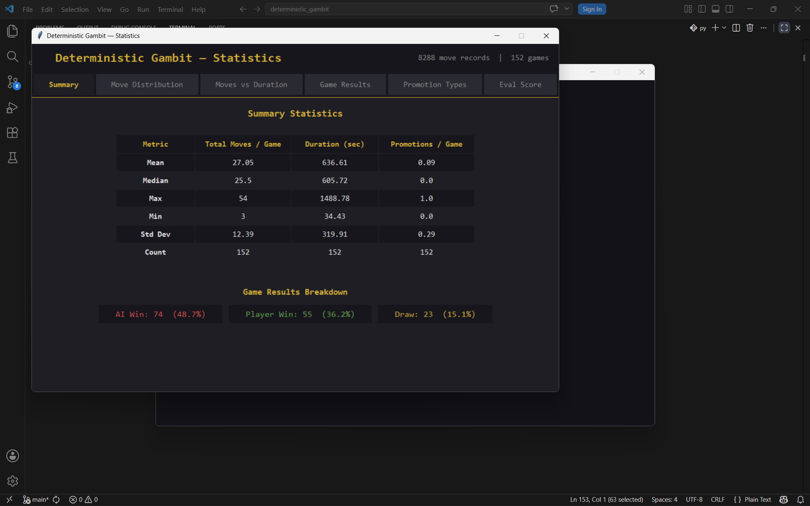
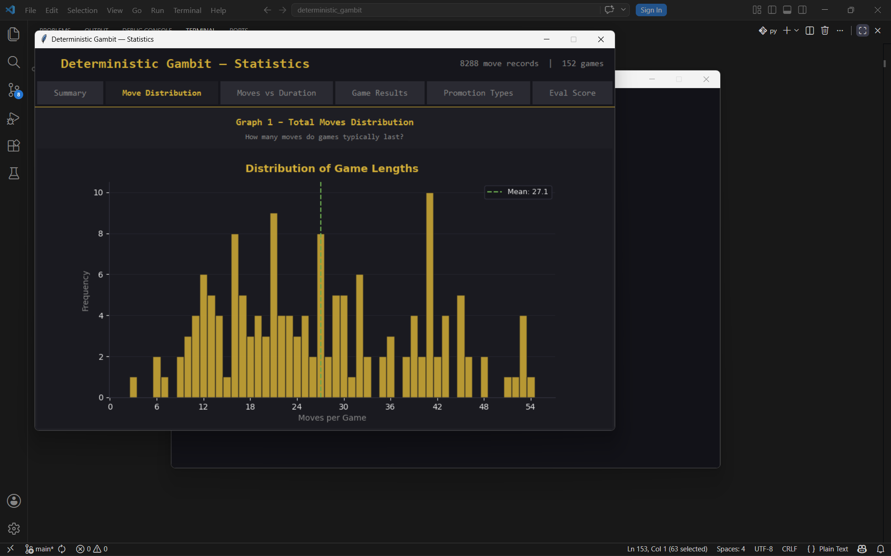
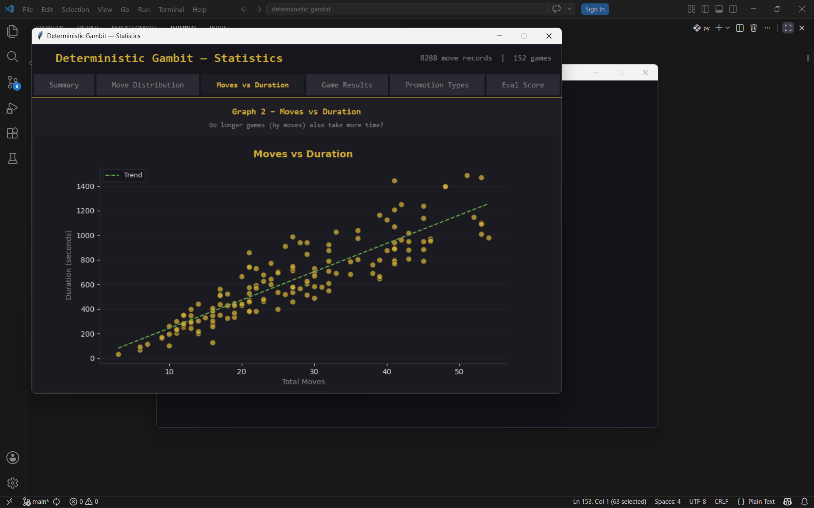
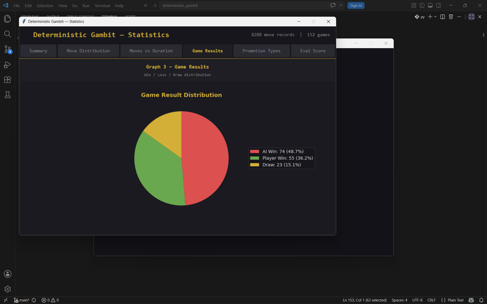
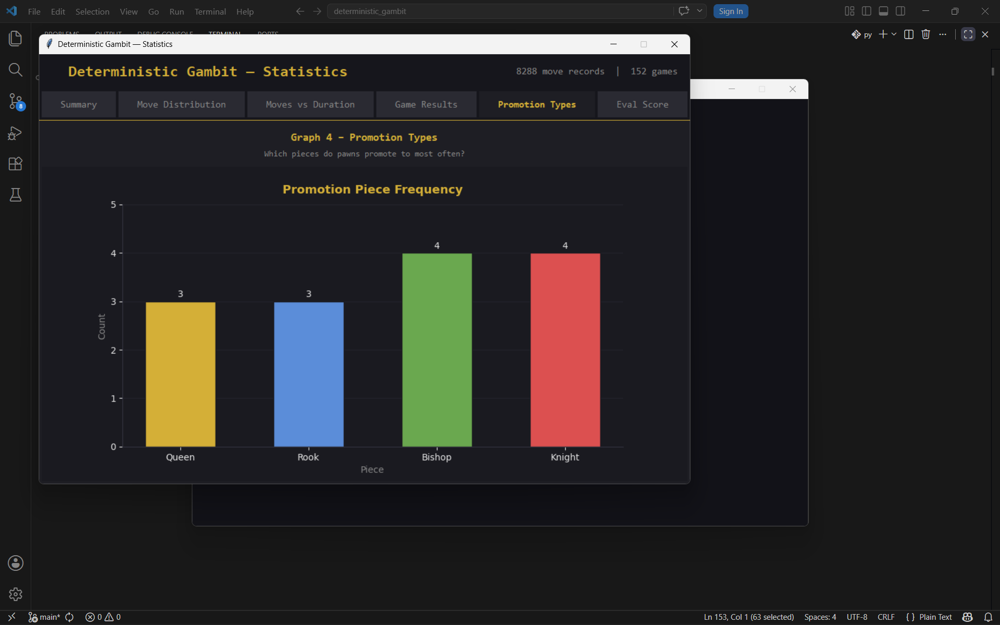
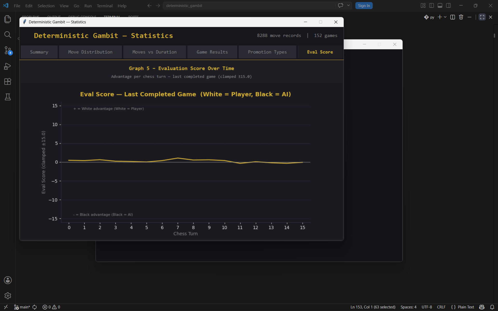

# Data Visualization

This document covers all data-related components of Deterministic Gambit — how data is collected, what it represents, and how each visualization communicates player performance and game trends.

---

## Data Collection Overview

Every move made in Deterministic Gambit is automatically recorded to two CSV files stored in the `data/` folder. No manual input is required from the player. The `move_data.csv` file captures one row per half-move (ply), storing the game ID, turn number, which player moved, the piece type, origin and destination squares, how long the player spent on the move, the Stockfish evaluation score after the move, and whether a pawn promotion occurred. The `game_data.csv` file captures one row per completed game, storing the outcome, player colour, total ply count, game duration, and promotion summary. Together these two files feed all five charts and the summary table in the statistics dashboard.

---

## Summary Table

The summary table is the first thing shown when the Statistics window opens. It presents descriptive statistics — mean, median, maximum, minimum, standard deviation, and count — for three key metrics across all recorded games: total moves per game (measured in full moves, where white + black = 1 move), game duration in seconds, and promotions per game. This gives a quick numerical overview of how long games typically last, how much variation exists in game length, and how frequently the deterministic promotion rule comes into play. Because promotion outcomes are fixed by file, tracking promotion frequency across games reveals whether players are successfully advancing pawns.

---

## Graph 1 — Game Length Distribution

Graph 1 is a histogram showing how many moves (full moves: white + black = 1) each recorded game lasted. Each bar covers exactly one integer move count, so a bar at position 30 represents all games that ended on the 30th full move. A vertical dashed line marks the mean game length. This chart reveals the typical game length for the player's skill level and style — shorter games suggest more tactical, decisive play (or early blunders against a strong AI), while longer distributions indicate more positional, drawn-out games. In Deterministic Gambit, game length is particularly interesting because the fixed promotion rule can change endgame dynamics.

---

## Graph 2 — Moves vs Duration

Graph 2 is a scatter plot where each point represents one game, with the number of full moves on the horizontal axis and the total game duration in seconds on the vertical axis. A trend line (computed via linear regression when three or more games are available) shows the overall relationship between game length and time spent. Points far above the trend line represent games where the player spent disproportionately long per move — likely during complex middlegame positions or time-pressure decisions. Points below the trend line represent fast games, either short decisive wins/losses or games played under tight time controls. This chart is useful for identifying whether longer games genuinely require more thinking time or whether game length is driven by the AI's pace rather than the player's deliberation.

---

## Graph 3 — Game Results

Graph 3 is a pie chart showing the proportion of Player Wins, AI Wins, and Draws across all recorded games. Slices are sorted in descending order by count and rendered clockwise from the 12 o'clock position, so the most common outcome always appears first. Each slice is labelled in the legend with its count and percentage. This chart gives an immediate read on overall performance against the AI. A dominant AI Win slice at high difficulty levels is expected; improvement over time should be visible as the Player Win slice grows. Draws are relatively rare in Deterministic Gambit because the fixed promotion rule tends to create material imbalances that tip endgames decisively — a player promoting to other pieces instead of a Queen has noticeably less mating power, making draws harder to hold.

---

## Graph 4 — Promotion Types

Graph 4 is a bar chart showing how many times each promotion piece type (Queen, Rook, Bishop, Knight) has appeared across all games. All four bars are always displayed, even when a type has zero promotions, so the chart is readable from the first game. Bar colours are distinct (gold, blue, green, red) and count labels appear inside each bar. This chart is the most thematically specific visualization in the dashboard — it directly reflects the deterministic promotion rule that defines the game variant. A heavy skew toward Queen promotions means the player is successfully advancing d/e-file pawns; frequent Rook or Knight or Bishop promotions indicate the player is relying on a/h or b/g or c/f-file passed pawns, which are strategically weaker promotion outcomes. Tracking this distribution over many games reveals pawn strategy tendencies.

---

## Graph 5 — Evaluation Score Over Time

Graph 5 is a line chart showing the Stockfish evaluation score across every full move of the most recently completed game. The x-axis shows the full move number starting from 0, and the y-axis shows the evaluation clamped to ±15.0 (positive = White advantage, negative = Black advantage). The final data point is taken from Stockfish's evaluation of the terminal position. Annotation labels identify which side is White and which is Black (Player or AI). Dotted horizontal reference lines are drawn at ±5.0 to mark the threshold of a significant advantage. This chart is the most analytically rich visualization — it shows when the game was balanced, when a decisive advantage was gained or lost, and whether the player fought back from a bad position or converted a winning one cleanly. Sudden swings identify tactical blunders or missed opportunities.
